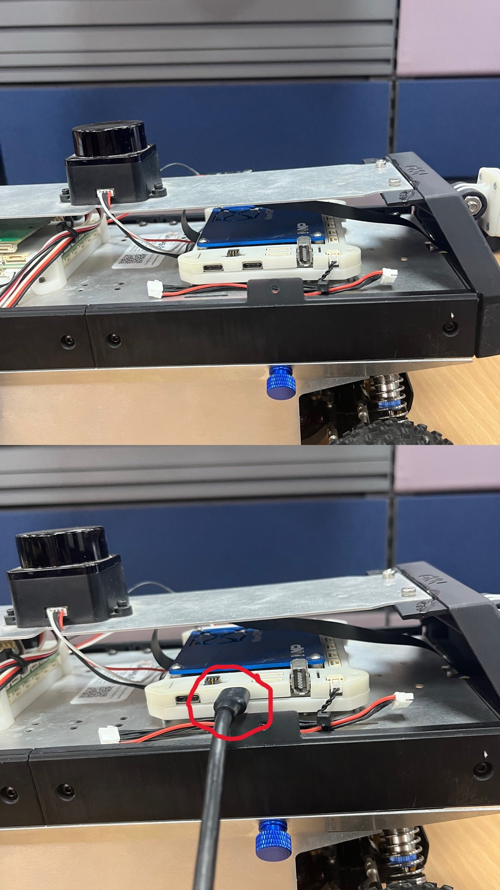

# NXP Cup India 2026 — Grand Finale
## Buggy Connection & Code Deployment Guide

> **Platform:** NavQPlus (NXP AIM Kit) + B3RB Robotic Platform  
> **Note:** All terminal commands are to be run **on the NavQPlus**, unless stated otherwise.

---

> **<span style="color:red">!!CRITICAL WARNING — READ BEFORE YOU BEGIN!!</span>**
>
> **<span style="color:orange">DO NOT connect the battery and the USB cable to the NavQPlus simultaneously. Powering the board through both the battery and a laptop USB connection at the same time can cause a dangerous reverse current flow. This may result in immediate laptop shutdown, permanent damage to your laptop's USB port or motherboard, and potential damage to the NavQPlus itself. Always ensure only one power source is connected at a time.</span>**

---

## Table of Contents

1. [Powering On the NavQPlus](#1-powering-on-the-navqplus)
2. [First-Time Login via USB-C Gadget Ethernet](#2-first-time-login-via-usb-c-gadget-ethernet)
3. [Configuring WiFi](#3-configuring-wifi)
4. [Optional — Change Hostname / Username / Password](#4-optional--change-hostname--username--password)
5. [Connecting to NavQPlus over WiFi](#5-connecting-to-navqplus-over-wifi)
6. [Preparing the Home Directory](#6-preparing-the-home-directory)
7. [Installing CogniPilot](#7-installing-cognipilot)
8. [Cloning the NXP Cup India 2026 Repository](#8-cloning-the-nxp-cup-india-2026-repository)
9. [Setting Up the Workspace](#9-setting-up-the-workspace)
10. [Updating & Running Your Code on the Buggy](#10-updating--running-your-code-on-the-buggy)

---

## 1. Powering On the NavQPlus


Connect the USB-C® cable to the centermost (USB 2) port on the NavQPlus as shown above.


For the first-time setup, power the NavQPlus using a **USB-C® cable** connected to the **centermost (USB 2) USB-C® port** on the board. Plug the other end into your laptop.

**Do not connect the battery at this stage.**

Once powered, the NavQPlus will begin booting. You can confirm it has fully booted by checking the **status LEDs** on the board:

| LED Location | Expected State |
|---|---|
| 3 LEDs near the USB1 port | All **ON** |
| 2 LEDs near the CAN bus connectors | Both **ON** |

When all the above LEDs are lit, the NavQPlus has booted successfully and is ready for login.

---

## 2. First-Time Login via USB-C Gadget Ethernet

The default login credentials for NavQPlus are:

| Field | Value |
|---|---|
| **Username** | `user` |
| **Password** | `user` |

For the first-time setup, you will log in using the **USB-C® Gadget Ethernet** method. This creates a virtual Ethernet interface between your laptop and the NavQPlus over the USB-C® cable.

**NavQPlus USB network interface details:**

| Parameter | Value |
|---|---|
| Interface | `usb0` |
| IP Address (NavQPlus) | `192.168.186.3` |
| Network Mask | `255.255.255.0` |

**Steps:**

1. Connect a USB-C® cable from your laptop to the NavQPlus.
2. On your laptop, assign a static IP to the gadget ethernet interface that appears:
   - **IP Address:** `192.168.186.2`
   - **Network Mask:** `255.255.255.0`

   *(This can be done via Network Manager on Linux, or Network Settings on Windows/macOS.)*

3. Once the interface is configured, SSH into the NavQPlus:

```bash
ssh user@imx8mpnavq.local
```

Or, depending on your network configuration:

```bash
ssh user@imx8mpnavq
```

---

## 3. Configuring WiFi

> Run these commands on the NavQPlus terminal.

WiFi is configured using the `nmcli` command-line tool.

**Connect to a WiFi network:**

```bash
sudo nmcli device wifi connect <network_name> password "<password>"
```

Replace `<network_name>` with your WiFi SSID and `<password>` with your WiFi password.

**Example:**

```bash
sudo nmcli device wifi connect "MyWiFi" password "mypassword123"
```

**If you are unable to connect, first check the available networks:**

```bash
sudo nmcli device wifi list
```

**To verify which WiFi network the NavQPlus is currently connected to:**

```bash
nmcli connection show --active
```

Once connected, the NavQPlus will automatically reconnect to the same WiFi network on every subsequent reboot — no need to re-enter credentials.

---

## 4. Optional — Change Hostname / Username / Password

This section is optional. Only proceed if you need to customize your NavQPlus setup.

### Change Hostname


```bash
hostnamectl set-hostname <new_hostname>
```

### Change Password

```bash
passwd
```

### Change Username

> **<span style="color:red">DANGER</span>**: <span style="color:orange">Modifying the username is a high-risk operation that can corrupt the system state and may necessitate a complete re-flash of the board. Proceed only if absolutely certain this is required.</span>

```bash
usermod -l <new_username> user
mv /home/user /home/<new_username>
```

---

**Once Sections 3 and 4 are complete, you need to safely transition from USB power to battery power before proceeding further.**

> **<span style="color:red">IMPORTANT</span>**: <span style="color:orange">Safely eject and disconnect the USB-C® cable from the NavQPlus first. Wait a moment to ensure the board has fully powered down, then connect the battery to the NavQPlus using the JST-GH power port. From this point onwards, the NavQPlus will be powered by the battery and you will connect to it wirelessly over WiFi.</span>

---

## 5. Connecting to NavQPlus over WiFi

Once WiFi has been configured (Section 3) and the NavQPlus is running on battery power, connect to it wirelessly from your laptop over SSH.

```bash
ssh user@imx8mpnavq.local
```

Or, depending on your network configuration:

```bash
ssh user@imx8mpnavq
```

If you changed the hostname in Section 4, replace `imx8mpnavq` with your updated hostname.

---

## 6. Preparing the Home Directory

> Run on the NavQPlus terminal.

Before installing CogniPilot, ensure the home directory contains only the required files. Navigate to the home directory and list its contents:

```bash
cd ~
ls -la
```

**The following 3 files must be present and must NOT be deleted:**

| File | Type |
|---|---|
| `cyclonedds.xml` | CycloneDDS configuration file |
| `install_cognipilot.sh` | CogniPilot installation script |
| `navqplus_install.sh` | NavQPlus setup script |

> **<span style="color:orange">WARNING</span>**: <span style="color:yellow">You need to remove any other files or folders not listed above. Use the following command to delete unwanted items:</span>

```bash
rm -rf <file_or_folder_name>
```

Once only the 3 files above remain, you are ready to proceed with the CogniPilot installation.

---

## 7. Installing CogniPilot

> **ALL steps in this section are to be run on the NavQPlus.**

Before proceeding, ensure the NavQPlus is connected to the internet on a network that permits downloads from **GitHub** and **Ubuntu package servers**.

The home directory includes a pre-bundled helper script that downloads and runs the latest CogniPilot installer for NavQPlus. Run it as follows:

```bash
./install_cognipilot.sh
```

The installer will present a series of questions during the process. Respond as follows:

---

**When asked whether to use SSH keys for GitHub:**

You need to enter `n` to clone repositories over HTTPS. SSH keys are not being used for this setup.

---

**When asked whether to optimize runtime performance:**

You need to enter `y`. Runtime optimization is strongly recommended for improved performance during competition runs.

---

**When asked to choose a release:**

You need to enter `airy`. The `airy` release is the stable, competition-ready build. Do not select `main`, as it is an active development branch and may be unstable.

---

**When asked to choose a platform:**

You need to enter `b3rb`. This is the Ackermann-based robotic platform used in NXP Cup India 2026. `elm4` is a differential drive platform and is not applicable here.

---

The installer will now download and compile CogniPilot. This process may take several minutes. Ensure you are on a **high-speed, uninterrupted internet connection** for the duration of the installation.

> **<span style="color:orange">WARNING</span>**: <span style="color:yellow">Do not interrupt or terminate the process once it has started. If the installation fails or is interrupted for any reason, you need to delete the `cognipilot` directory and re-run the installer from scratch to ensure a clean, uncorrupted installation:</span>

```bash
rm -rf ~/cognipilot
./install_cognipilot.sh
```

---

## 8. Cloning the NXP Cup India 2026 Repository

> Run on the NavQPlus terminal.

Clone the official NXP Cup India 2026 competition repository:

```bash
git clone https://github.com/NXP-Robotics/NXP_CUP_INDIA_2026
```

Repository link: [**NXP Cup 2026 Github**](https://github.com/NXP-Robotics/NXP_CUP_INDIA_2026)

This repository contains the `synapse_msgs` package and the `b3rb_ros_line_follower` package required for the competition.

---

## 9. Setting Up the Workspace

> Run on the NavQPlus terminal.

After cloning the repository, replace the default `synapse_msgs` package with the competition-specific version.

### Replace `synapse_msgs`

```bash
cp -r ~/NXP_CUP_INDIA_2026/synapse_msgs ~/cognipilot/cranium/src/
```

This replaces the default `synapse_msgs` with the version tailored for NXP Cup India 2026.

---

**About `b3rb_ros_line_follower`:**

The `b3rb_ros_line_follower` folder is your primary working package. All code changes — line-following logic, detection algorithms, control strategies, and simulation code — are to be made within this folder. You can continue to update and refine the code as you progress through the competition.

---

## 10. Updating & Running Your Code on the Buggy

> **ALL steps below are to be run on the NavQPlus.**

Each time you make changes to your code and wish to test them on the buggy, follow this workflow:

---

### Step 1: Connect to WiFi

Ensure the NavQPlus is connected to your WiFi network. Refer to [Section 3](#3-configuring-wifi) if needed.

---

### Step 2: Make Your Code Changes

Edit your code within the `b3rb_ros_line_follower` package:

```
~/cognipilot/cranium/src/b3rb_ros_line_follower/
```

---

### Step 3: SSH into the NavQPlus

```bash
ssh user@imx8mpnavq.local
```

---

### Step 4: Build the Workspace

```bash
cd ~/cognipilot/cranium/
colcon build
```

The build may take a few minutes. Wait for it to complete successfully before proceeding.

---

### Step 5: Launch the Robot — Terminal 1

```bash
source ~/cognipilot/cranium/install/setup.bash
ros2 launch b3rb_bringup robot.launch.py
```

Keep this terminal open. This is the main robot bringup process and must remain running at all times.

---

### Step 6: Run the ROS 2 Nodes — Open New Terminals

> **<span style="color:orange">WARNING</span>**: <span style="color:yellow">Each of the following commands must be run in a separate terminal window (i.e., a new SSH session). You need to source the workspace in every new terminal before executing any ROS 2 command.</span>

**Terminal 2 — Vectors Node**

```bash
source ~/cognipilot/cranium/install/setup.bash
ros2 run b3rb_ros_line_follower vectors
```

**Terminal 3 — Detect Node**

```bash
source ~/cognipilot/cranium/install/setup.bash
ros2 run b3rb_ros_line_follower detect
```

**Terminal 4 — QR Detect Node**

```bash
source ~/cognipilot/cranium/install/setup.bash
ros2 run b3rb_ros_line_follower qr_detect
```

**Terminal 5 — Runner Node (Launch this LAST)**

```bash
source ~/cognipilot/cranium/install/setup.bash
ros2 run b3rb_ros_line_follower runner
```

> **<span style="color:orange">WARNING</span>**: <span style="color:yellow">The `runner` node must always be launched last, only after all other nodes are confirmed to be running.</span>

---

### Terminal Launch Order — Quick Reference

| Order | Terminal | Command |
|:---:|---|---|
| 1 | Main | `ros2 launch b3rb_bringup robot.launch.py` |
| 2 | New Terminal | `ros2 run b3rb_ros_line_follower vectors` |
| 3 | New Terminal | `ros2 run b3rb_ros_line_follower detect` |
| 4 | New Terminal | `ros2 run b3rb_ros_line_follower qr_detect` |
| **5** | New Terminal **(LAST)** | `ros2 run b3rb_ros_line_follower runner` |

```
source ~/cognipilot/cranium/install/setup.bash
```
must be run in **every** new terminal session before executing any ROS 2 command.

---

*NXP Cup India 2026 — Grand Finale | NXP Semiconductors*